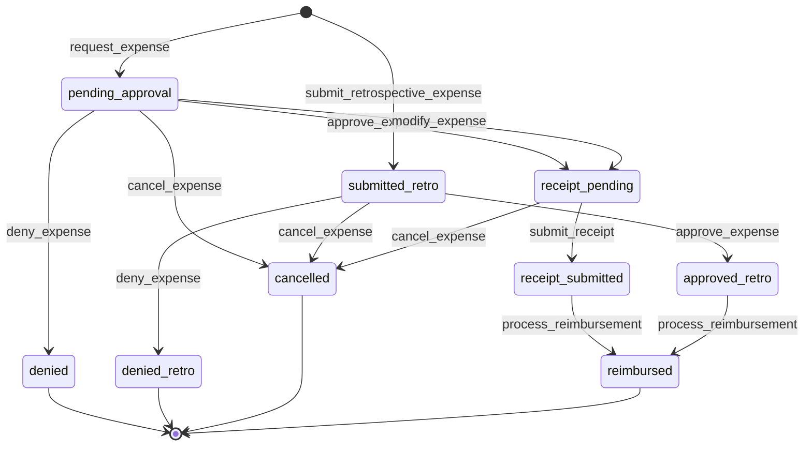
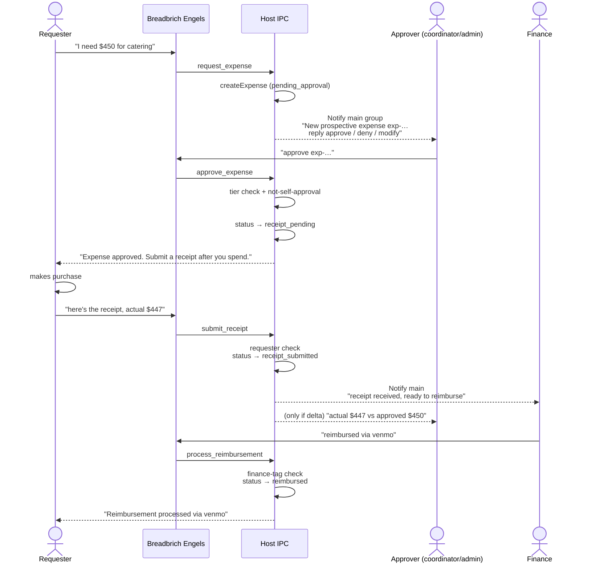
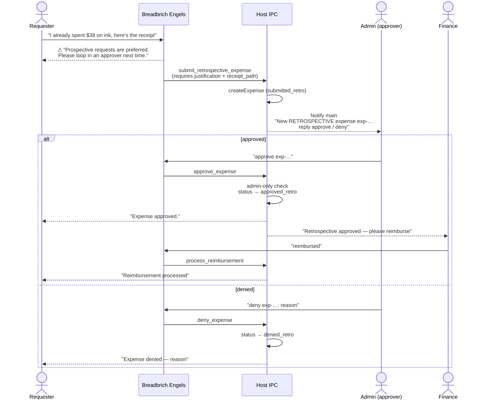
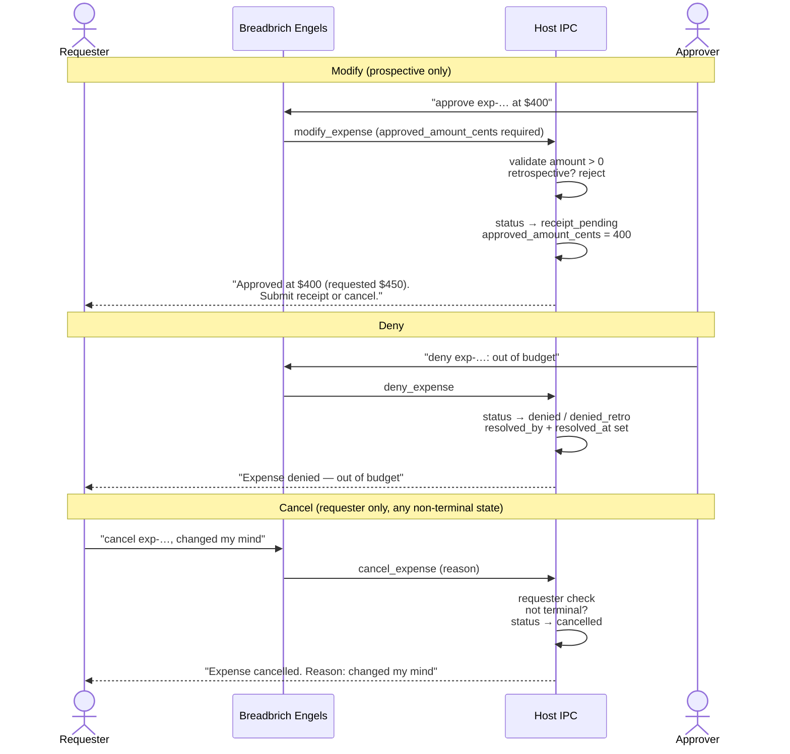
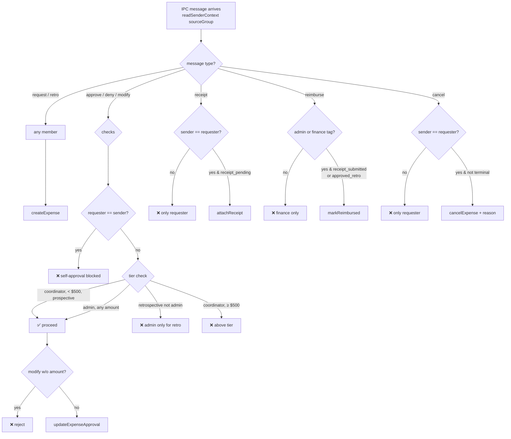

# Expense workflow — user flows

Diagrams for the expenses feature introduced in PR #29.

## 1. Expense lifecycle (state machine)

## 2. Prospective (preferred) happy path

## 3. Retrospective (discouraged) path

## 4. Modify, deny, and cancel variants

## 5. Authorization gates (at-a-glance)

